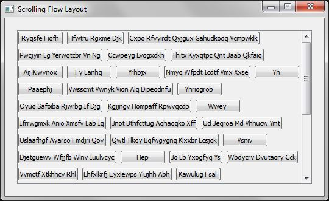

**PyQtFlowLayout**

The flow layout that many have shared from the given examples needs additional methods to become really useful, in particular, I needed it to be able to propagate up into a scrollable wrapper.

**Example**

Usage:

    scroller = ScrollingFlowWidget()
    scroller.addWidget( QtGui.QPushButton("Push Me") )
    scroller.addWidget( QtGui.QPushButton("Don't push") )
    ...
